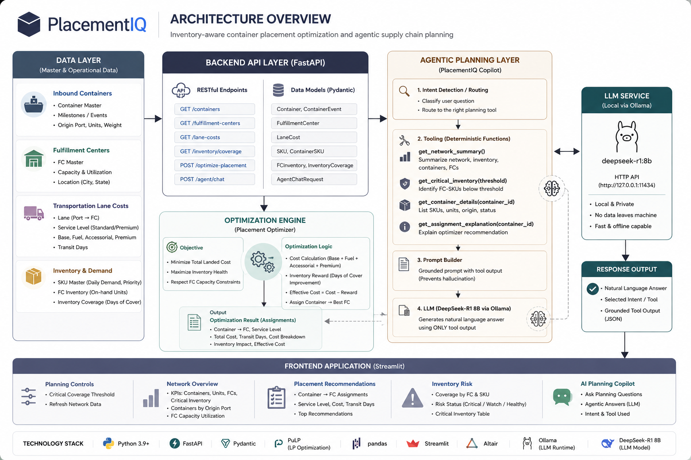

# PlacementIQ 📦

> Inventory-aware container placement optimization and agentic supply chain planning platform.

PlacementIQ is a supply chain optimization platform that helps planners determine the optimal fulfillment center assignment for inbound containers while balancing transportation costs, inventory health, service levels, and network capacity constraints.

The platform combines mathematical optimization, operational analytics, and an AI-powered planning copilot to support data-driven inbound logistics decisions.

---

## Business Problem

Large fulfillment networks receive thousands of inbound containers from ports every week. Determining where each container should be routed is a complex planning problem involving:

- Transportation costs
- Fulfillment-center capacity constraints
- Inventory availability
- Service-level requirements
- Risk of stockouts

Traditional approaches often rely on static business rules or manual decision-making, which can lead to higher costs and inventory imbalances.

PlacementIQ provides an optimization-driven approach to improve these decisions.

---

## Key Features

### Optimization Engine

- Container-to-fulfillment-center assignment optimization
- Multi-destination lane evaluation
- Service-level selection (Standard vs Premium)
- Transportation cost minimization
- Inventory-aware placement decisions
- Capacity constraint enforcement

### Inventory Risk Intelligence

- Days-of-cover calculations
- FC-SKU inventory monitoring
- Critical inventory identification
- Inventory risk visualization

### Agentic Planning Copilot

- Natural language planning assistant
- Tool-based reasoning architecture
- Inventory risk explanations
- Optimization recommendation explanations
- Container intelligence queries
- Network summary generation

### Interactive Dashboard

- Network overview
- Placement recommendations
- Inventory risk analysis
- AI planning copilot

---

# System Architecture



---

## Architecture Overview

```text
Data Layer
    │
    ▼
FastAPI Backend
    │
    ├── Data Models (Pydantic)
    ├── Optimization Engine
    └── Agent Tools
            │
            ▼
      DeepSeek-R1
      (Local via Ollama)
            │
            ▼
      Planning Copilot
            │
            ▼
      Streamlit Dashboard
```

---

## Optimization Problem

### Decision Variable

```text
x(container, fulfillment_center, service_level)
```

The optimizer selects:

```text
Container
    → Fulfillment Center
        → Service Level
```

---

### Objective Function

Minimize:

```text
Transportation Cost
-
Inventory Reward
```

while satisfying:

- Fulfillment-center capacity constraints
- Lane eligibility constraints
- Single-assignment constraints

---

### Transportation Cost Components

```text
Base Cost
+ Fuel Surcharge
+ Accessorial Cost
+ Service Level Premium
```

---

### Inventory-Aware Logic

The optimizer rewards placement decisions that improve inventory health in fulfillment centers with lower inventory coverage.

Example:

```text
FC Dallas
Days of Cover = 5

FC SoCal
Days of Cover = 20
```

The optimizer prioritizes inventory replenishment where risk is highest.

---

## Agentic Planning Architecture

PlacementIQ uses a tool-based agent design.

### User Question

```text
What is the most critical fulfillment center?
```

### Agent Flow

```text
Question
    │
    ▼
Intent Detection
    │
    ▼
Tool Selection
    │
    ├── get_network_summary()
    ├── get_critical_inventory()
    ├── get_container_details()
    └── get_assignment_explanation()
    │
    ▼
Grounded Prompt
    │
    ▼
DeepSeek-R1 (Ollama)
    │
    ▼
Natural Language Answer
```

This architecture reduces hallucinations by grounding responses on deterministic planning tools.

---

## Dashboard Views

### Network Overview

Provides:

- Container visibility
- Network KPIs
- Capacity utilization
- Operational status

### Placement Recommendations

Displays:

- Recommended fulfillment center
- Service level
- Transportation cost
- Inventory reward
- Effective cost

### Inventory Risk

Displays:

- Inventory coverage
- Critical inventory records
- Risk status classification

### AI Planning Copilot

Supports questions such as:

```text
Summarize the current network.

What is the most critical fulfillment center?

What SKUs are inside CONT001?

Why was CONT001 assigned to FC_SOCAL?
```

---

## Technology Stack

### Backend

- Python
- FastAPI
- Pydantic

### Optimization

- OR-Tools
- Operations Research
- Constraint Optimization

### Frontend

- Streamlit
- Altair
- Pandas

### AI Layer

- Ollama
- DeepSeek-R1
- Tool-based Agent Architecture

---

## Project Structure

```text
PlacementIQ/
│
├── backend/
│   ├── api/
│   ├── optimizer/
│   ├── agents/
│   └── models/
│
├── frontend/
│   └── app.py
│
├── docs/
│   └── placementiq_architecture.png
│
├── tests/
│
├── requirements.txt
├── README.md
└── .gitignore
```

---

## Future Enhancements

- Real-time shipment visibility integration
- Transit-time optimization
- Demand forecasting integration
- Multi-echelon inventory optimization
- Scenario simulation engine
- Reinforcement learning-based planning
- Supply chain digital twin
- Multi-agent planning architecture

---
